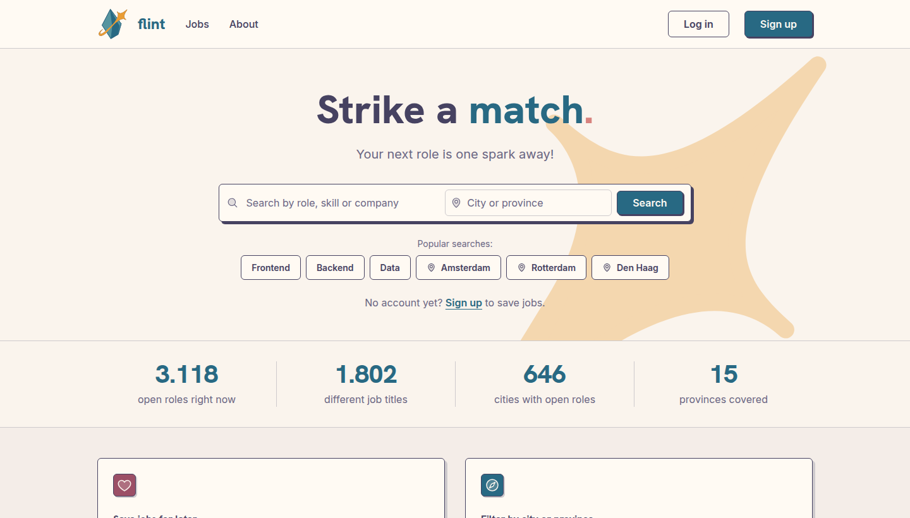
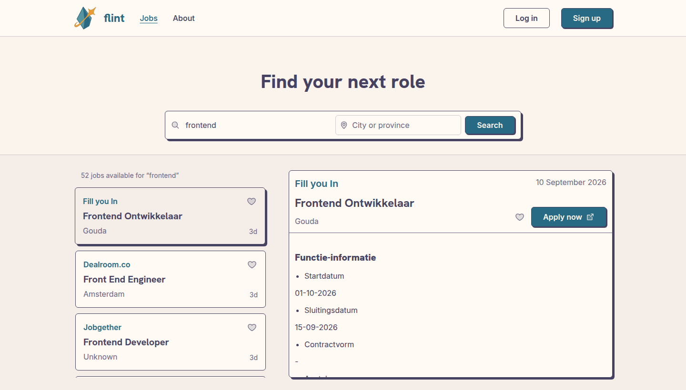
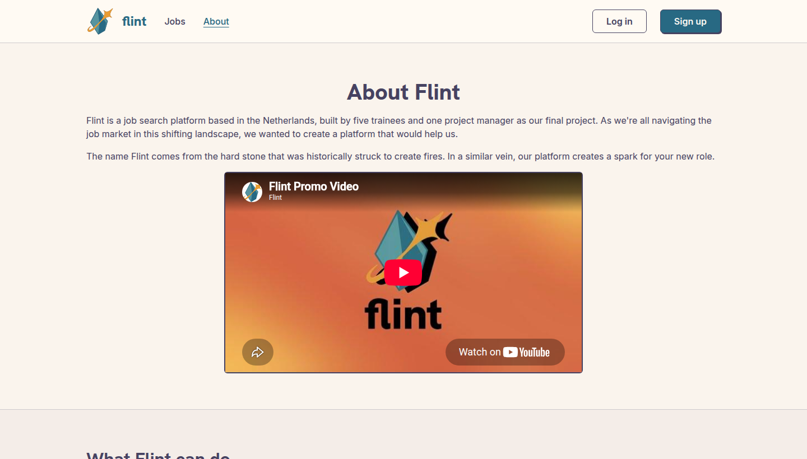
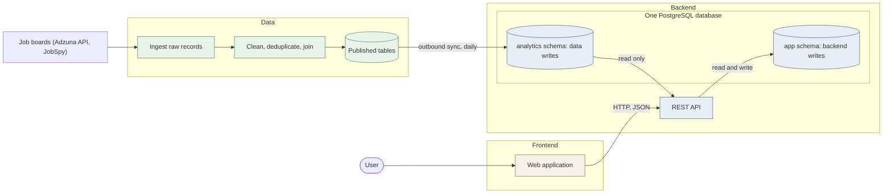

# Flint — find your next role in the Netherlands

This is our final project for the [HackYourFuture program](https://hackyourfuture.net/program), built as a
team with three roles — frontend, backend, and data engineering. We worked in an agile way, in short
sprints, supported by a group of mentors: a Product Manager and a Tech Lead. The project is open source
and available on GitHub.

### 🌐 [Live demo](https://c55b.hyf.dev)

---

## Table of contents

- [About the project](#about-the-project)
- [Screenshots](#screenshots)
- [Features](#features)
- [Tech stack](#tech-stack)
- [Architecture](#high-level-architecture)
- [Project structure](#project-structure)
- [Documentation](#documentation)
- [CI/CD](#cicd)
- [Team](#team)
- [Roadmap](#roadmap)

---

## About the project

Flint is a job search platform for the Dutch job market. It collects postings from several job boards
into one database every day, and puts them behind a fast, keyboard-friendly interface where you can
search by role, skill, company or place, read the full posting, and keep the ones you like behind a
free account.

We built it for people like us: job seekers who are tired of juggling six tabs of job boards with six
different filters. The name comes from the flint stone that was struck to make fire. Flint is the spark;
the fire is up to you.

## Screenshots







## Features

- **Search the whole market from one box.** Search by role, skill or company, with suggestions as you
  type, and narrow the results to a city or a province.
- **Read the posting without leaving the page.** Results and the full description sit side by side;
  more jobs load as you scroll.
- **Apply at the source.** Every job links to the original posting, so you apply where the employer is
  looking.
- **Save jobs for later.** Sign up, hit the heart on any job, and find it again on your saved-jobs page,
  which has the same search and location filter.
- **Popular searches** to get going with one click.
- **Live numbers** on the home page: open roles, distinct titles, cities and provinces covered.
- **Accessible by design.** Every control is labelled and reachable by keyboard, focus is always visible,
  and animation respects the reduced-motion preference.

## Tech stack

| Layer | Technologies |
| --- | --- |
| **Frontend** | Next.js 16, React 19, TypeScript, CSS Modules, Biome |
| **Backend** | Java 25, Spring Boot, Spring Security, PostgreSQL, Flyway, Maven |
| **Data** | Python, SQL, dbt, Airflow, Databricks, Azure Container Apps |
| **Infrastructure** | Docker, Docker Compose, GitHub Actions, GitHub Container Registry |

## High-level Architecture

Three tracks, three layers, and one database where two of them meet.



The data pipeline runs once a day on Airflow: it ingests postings from the job boards, cleans and
deduplicates them with dbt on Databricks, and publishes finished tables into the **`analytics`** schema
of the application database. The backend reads those tables and owns the **`app`** schema, which holds
accounts and saved jobs. The frontend only ever talks to the backend's REST API: server-rendered pages
call it directly, and the browser reaches it through a same-origin proxy so the session cookie works
without CORS.

Three rules keep the picture honest:

- **The two schemas have two owners.** The data pipeline writes `analytics` and nothing else. The
  backend writes `app` and nothing else. Two database roles enforce it.
- **The data track publishes finished tables, not raw material.** The backend fills a screen with one
  `SELECT`, without joining sources or knowing where a row came from.
- **Records the application creates stay on the application's side.** Accounts and saved jobs never
  flow back into the pipeline.

## Project structure

```
.
├── backend/            Spring Boot REST API (Java, Maven, Flyway)
├── frontend/           Next.js web app (TypeScript, React)
├── data/               Data pipeline (Python, dbt, Airflow)
├── scripts/            Scripts for local development and deployment
├── screenshots/        Images used in this README
├── .github/workflows/  CI/CD pipelines and PR checks
```

## Documentation

| What | Where |
| --- | --- |
| Frontend guide | [`frontend/README.md`](frontend/README.md) |
| Backend guide | [`backend/README.md`](backend/README.md) |
| Data pipeline guide | [`data/README.md`](data/README.md) |
| Live API reference (Scalar) | https://c55b.hyf.dev/api/docs |

## CI/CD

Four GitHub Actions workflows run automatically:

| Workflow | Triggers on | What it does |
| --- | --- | --- |
| [Backend CI/CD](.github/workflows/backend-ci-cd.yaml) | changes under `backend/**` | Checkstyle, tests, Docker build; pushes the image to GHCR on `main` |
| [Frontend CI/CD](.github/workflows/frontend-ci-cd.yaml) | changes under `frontend/**` | Biome lint, Next build, Docker build; pushes the image to GHCR on `main` |
| [Data CI/CD](.github/workflows/data-ci-cd.yaml) | changes under `data/**` | Lint, format checks (black, sqlfmt), dbt project check, type check, tests, Airflow DAG import; builds the ingestion image and updates the Azure Container Apps jobs on `main` |
| [PR checks](.github/workflows/pr-checks.yml) | every pull request | Requires the pull request template's sections and keeps the diff under 400 lines unless an `Oversized:` line explains why |

Pull requests are only merged when their checks pass.

## Team

| Name | Role | GitHub |
| --- | --- | --- |
| Jawad Al Bdiwi | Frontend | [@jivvyjams](https://github.com/jivvyjams) |
| Salem Ba-Rabuod | Backend | [@Barboud](https://github.com/Barboud) |
| Dagim Hailelassie | Backend | [@Unlock7](https://github.com/Unlock7) |
| Marah Aboghanem | Data engineering | [@mareh-aboghanem](https://github.com/mareh-aboghanem) |
| Hannah Nyongo | Data engineering | [@hannahwn](https://github.com/hannahwn) |
| Jana Gombitová | Project manager | [@janagombitova](https://github.com/janagombitova) |

## Roadmap

- [ ] **Profile page and recommendations.** The API for preferred location, skills and recommended jobs
      exists; the page is under construction and waits for skill extraction in the pipeline to fill the
      job data it ranks on.
- [ ] **Richer job details.** Salary, contract type, seniority and weekly hours are in the API but
      sparsely filled by the sources today; they appear in the UI once the data is reliable.
- [ ] **Mobile layout.** The app is designed for desktop first; the two-pane jobs page needs a
      single-column fallback.
- [ ] **Dark mode**, based on the Rose Pine palette the light theme already uses.
- [ ] **End-to-end tests** for the search and save flows.
